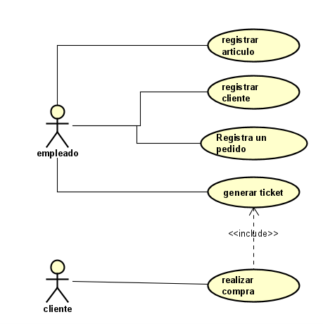
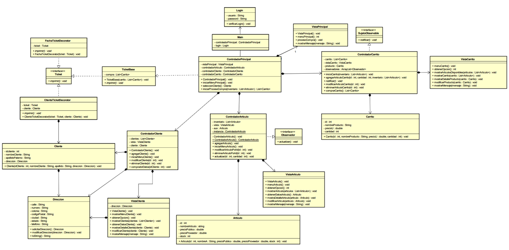
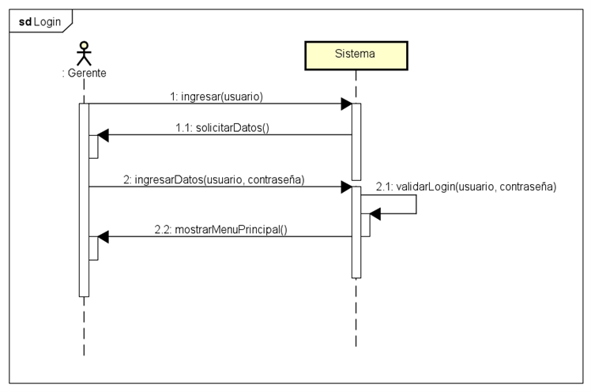
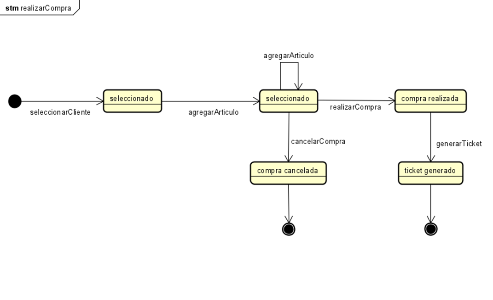
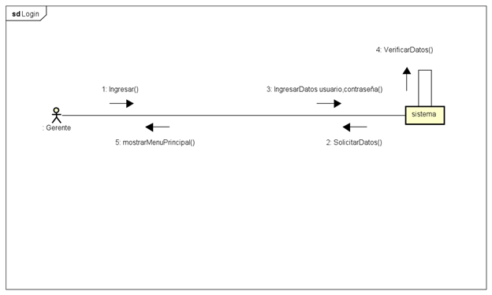
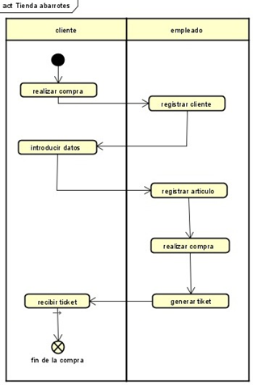

# Diagramas usados en el proyecto
- Diagrama de casos de uso  

- Diagrama de clases  

- Diagrama de secuencia  

- Diagrama de estado  

- Diagrama de colaboración   

- Diagrama de actividad  

